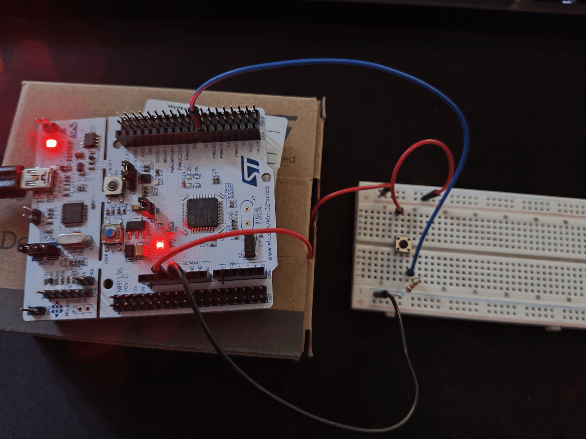

# STM32 Nucleo-L476RG – Blinky With External Button
This is a very simple project. When the external push button is pressed, the on-board LED (LD2) turns on. When released, the LED turns off.

<div align="center">
    
</div>

## Hardware setup
**Components:**
* 4-pin button
* 1.2kΩ resistor
* Breadboard + wires

**Circuit:**
* One side of the button -> 3.3V
* Opposite side of button -> PA8 -> 1.2 kΩ pulldown resistor -> GND

```
		           PA8
		            ^
		            |
	    +--------+--+-->1.2kΩ Resistor-->GND
	    | Button |
3.3V -->+--------+
```

## Firmware Details
* PA8 is configured as ```GPIO_Input```
* LED pin (PA5) configured as ```GPIO_Output```